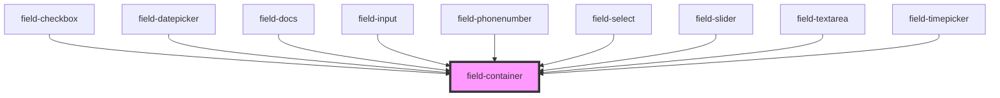

# dynamic-form

<!-- Auto Generated Below -->

## Properties

| Property          | Attribute          | Description | Type      | Default     |
| ----------------- | ------------------ | ----------- | --------- | ----------- |
| `displayRequired` | `display-required` |             | `boolean` | `false`     |
| `templateOptions` | `template-options` |             | `any`     | `undefined` |

## Dependencies

### Used by

 - [field-checkbox](fields)
 - [field-datepicker](fields)
 - [field-docs](fields)
 - [field-input](fields)
 - [field-phonenumber](fields)
 - [field-select](fields)
 - [field-slider](fields)
 - [field-textarea](fields)
 - [field-timepicker](fields)

### Graph

----------------------------------------------

*Built with [StencilJS](https://stenciljs.com/)*
