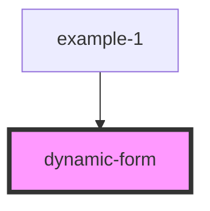

# dynamic-form

<!-- Auto Generated Below -->

## Properties

| Property | Attribute | Description | Type  | Default     |
| -------- | --------- | ----------- | ----- | ----------- |
| `fields` | `fields`  |             | `any` | `undefined` |
| `model`  | --        |             | `{}`  | `{}`        |

## Events

| Event   | Description | Type               |
| ------- | ----------- | ------------------ |
| `event` |             | `CustomEvent<any>` |

## Dependencies

### Used by

 - [example-1](../../examples)

### Graph

----------------------------------------------

*Built with [StencilJS](https://stenciljs.com/)*
